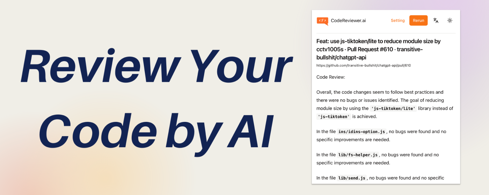
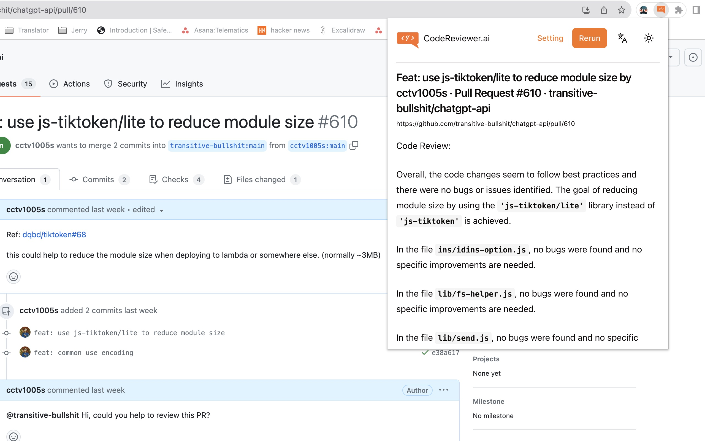

  

# CodeReviewer.ai

> 一个 Chrome 扩展，使用 [ChatGPT](https://chat.openai.com/) 或 [Dify](https://dify.ai/) 进行Code Review

- 💡 使用 ChatGPT 或 [Dify](https://dify.ai/)
- ⚡️ 支持多种编程语言
- 🛠️ 可配置的规则

## 使用方法

- 导航到您想要进行审查的 GitHub Pull Request 或 GitLab Merge Request 页面。
- 点击扩展图标。
- 您将在弹出窗口中获得来自 ChatGPT 的代码Code Review。

## 安装方法

### 从 Chrome Web Store 安装 (需科学上网)

[链接](https://chrome.google.com/webstore/detail/codereviewerai/miecffdapffnoalnjidkmdnoekkcenfn?hl=zh-CN&authuser=0)

### 从源代码安装

- 克隆该仓库
- 安装依赖 `yarn install`
- 运行构建脚本 `yarn build`
- 导航到 `chrome://extensions`
- 启用开发者模式
- 点击“加载已解压的扩展程序”按钮，导航到项目中的 `build` 目录

## 灵感来源

- https://github.com/sturdy-dev/codereview.gpt
- https://github.com/anc95/ChatGPT-CodeReview